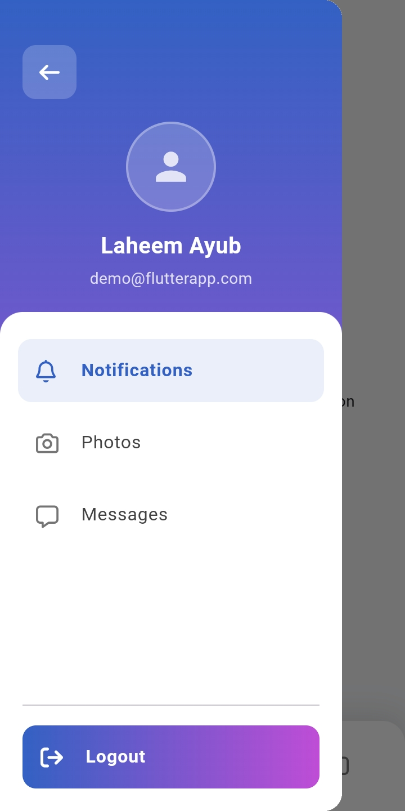

<h1 align="center">
  
  <br>
  CodeNova Flutter Mini-Task
</h1>

<p align="center">
  <b>A full-stack Flutter application developed for the CodeNova Mobile App Development hiring task.</b>
</p>

<p align="center">
  
  
  
</p>

---

## 📖 Overview

This repository contains the completed **Mobile App Development Task** assigned by **CodeNova**. The objective was to build a fun, simple, and elegant full-stack Flutter application integrating Firebase Authentication, Cloud Firestore, Cloudinary (for robust image uploads), and a Unified Notifications Service. The app focuses on clean code architecture and beautiful UI/UX design principles as requested.

## ✨ Features

The application consists of **6 primary screens** and incorporates the following functionalities as requested in the brief:

1. **Splash Screen**
   - Renders elegantly upon application launch.

2. **Authentication Flow (Sign Up / Sign In / Forgot Password)**
   - Powered by Firebase Auth.
   - Robust form validation checking for temporary/invalid emails.
   - Enforces strong password combinations.
   - "Forgot Password" functionality for secure password resets.

3. **Notification Screen (Tab 1)**
   - Features a prominent red button.
   - Triggers local push notifications directly to the device utilizing a custom `UnifiedNotificationService` (built for cross-platform compatibility across Web and Mobile).

4. **Photo Screen (Tab 2)**
   - Allows users to capture an image via Camera or select one from the Gallery.
   - Safely uploads the image directly to **Cloudinary** using its REST API via HTTP multi-part requests.
   - Saves the secure Cloudinary image URL in Firestore and fetches it to display on the frontend instantly.

5. **Text Screen (Tab 3)**
   - Users can write and publish text messages.
   - Messages are saved directly to Cloud Firestore.
   - Fetches and renders the text in real-time using Firestore `onSnapshot` (Streams).

6. **Navigation Drawer**
   - Additional drawer navigation for extended UI capabilities and profile management.

## 📱 Screenshots

Here's a glimpse of the application's beautiful UI/UX:

| Splash Screen | Sign Up | Sign In |
|:---:|:---:|:---:|
|  |  |  |

| Forgot Password | Drawer Navigation | Notification Tab |
|:---:|:---:|:---:|
|  |  |  |

| Photo Tab | Text Tab | |
|:---:|:---:|:---:|
|  |  | |

## 🛠️ Technology Stack

- **Framework**: [Flutter](https://flutter.dev/) (Dart)
- **Backend as a Service (BaaS)**: [Firebase](https://firebase.google.com/)
  - **Firebase Authentication**: Secure user login.
  - **Cloud Firestore**: Real-time NoSQL Database.
- **Media Storage**: [Cloudinary](https://cloudinary.com/) (Direct API integrations via HTTP).
- **Environment Management**: `flutter_dotenv` (for safely storing Cloudinary secrets).
- **Notifications**: Custom Unified Notification Service (wrapping `flutter_local_notifications`).
- **Image Handling**: `image_picker`
- **State Management**: Native Flutter (Stateful/Stateless Widgets, Streams)

## 🚀 Getting Started

Follow these instructions to get a copy of the project up and running on your local machine.

### Prerequisites
- Flutter SDK (`^3.9.0` or newer)
- Android Studio / VS Code
- *Note: To run the app from source with full backend connectivity, you need to configure your own Firebase project (`google-services.json` / `GoogleService-Info.plist`) and a `.env` file containing `CLOUDINARY_CLOUD_NAME` and `CLOUDINARY_UPLOAD_PRESET`. Alternatively, you can just test via the pre-built APK.*

### Installation

1. **Clone the repository:**
   ```bash
   git clone https://github.com/M-Laheem-Ayub/my-app-minitask.git
   cd my-app-minitask
   ```

2. **Install Dependencies:**
   ```bash
   flutter pub get
   ```

3. **Run the App:**
   ```bash
   flutter run
   ```

## 📦 Submission Details

As per the requirements, the built `.apk` file is hosted on Google Drive. 

🔗 **[Download APK Here](https://drive.google.com/file/d/1CvtXg2uSUXGJfQYhZmAWtG15dCA8zbRd/view?usp=sharing)**

---
<p align="center">
  Designed and developed with ❤️ for <b>CodeNova</b>.
</p>
